# Form

### 1. New form

1.1 Enter IDE from https://localhost:3090/ide

1.2 Open **TOOLS** menu and write down a comma separated list of fields like: 

first_name, last_name, pid, gender, birth_day, address, zip, city, county, country, email, mobile, social_status, photo, id_file, active


then click **new Form**. The new created form will look like this:

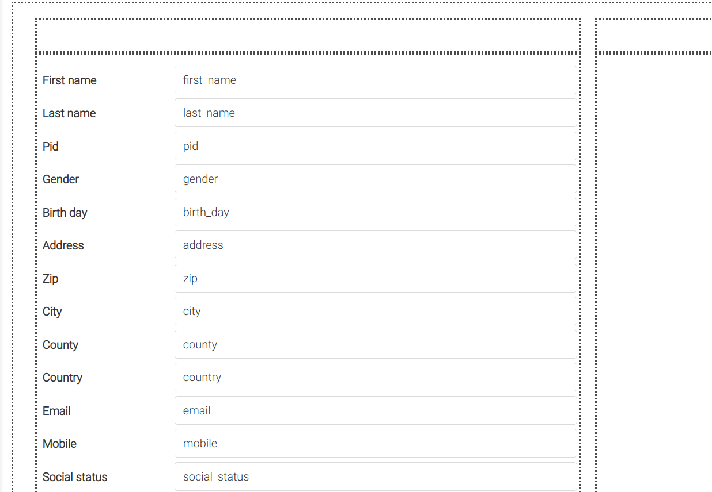

1.3 This form needs a documents list for navigation, so click on the **list** toolbar button to set it. Only a left side empty space could be observed here.

1.4 Click **properties** toolbar button to open the properties popup window. Be sure to be on the FORM tagName, and fill in query field with:

```
{
coll: 'patients',
fields: 'first_name,last_name',
sort: {last_name: 1, first_name: 1}
}
```

and list field with: 

```
last_name+first_name as name
```

1.5 Change the proposed form name (current datetime) in the toolbar name input, with the proper name Patients. Now it will look like this:

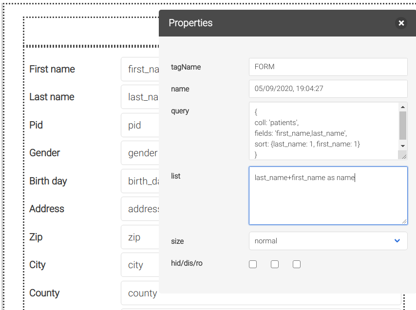

1.6 Click the **save** toolbar button, or the usual **CTRL+S** keyboard shortcut. The new created form will be present in the FORMS menu for further use. It is not finished, but it's already functional, and can be used to input data. Just add a menu item (MENU section):	

```
"Patients" forms.Patients
```

under Setup with a leading tab, and save. Pay attention tab indentation is important in menu definition. It will look like this:

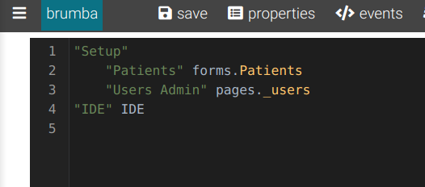

1.7 Now you can open the application from https://localhost:3090 open Setup/Patients menu and start inserting the first patients (just the name for now). As soon as you save the firs record, it will appear in the list on the left. Insert 2-3 more names to have a navigable list, and click on list items to see the record content in the form. This is an **infinite scroll-able list**. The list can be filtered by using the two search toolbar buttons, but more on this later.


### 2. Form layout

A new form has four containers, divided in 2 columns and 2 row. The first row is intended as header and is empty by default. Use it for title or other header elements. Initially all fields are inserted in the left column. If you don't need a double column form, the right column will rest empty, for layout purpose only. Use **CTRL+B** or toolbar **borders** button to toggle containers border, witch are purely informative, and are not saved.

Container management:

- add new column: from peer container context menu **Add column**
- add row: from parent container context menu **Add row**
- resize width: select container, then **SHIFT+arrow left/righ**t; last column not resizable
- delete: select container, then **CTRL+DEL**

Field management:

- add one: from container context menu **Add label/button/field/image**
- add multiple: select a container, open **TOOLS** menu and write down a comma separated list of fields, then click **add Fields** menu
- move to other container:  drag and drop over the empty space of the new container
- move in bottom of the same container: drag and drop over the bottom empty space
- move over other field: drag and drop over the other field; it will finish right aside
- resize: select label/input, then **SHIFT+arrow left/right**
- delete: select label/input, then **CTRL+DEL**

Now lets reface our form:

2.1 Move photo and id_file fields to the right column, by dragging them one by one.

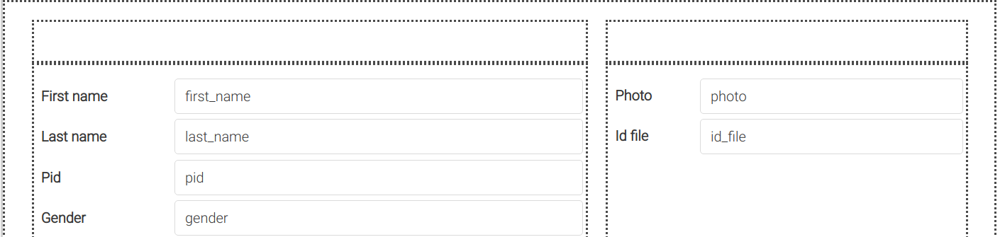

2.2 Drag city over zip, then county over zip.

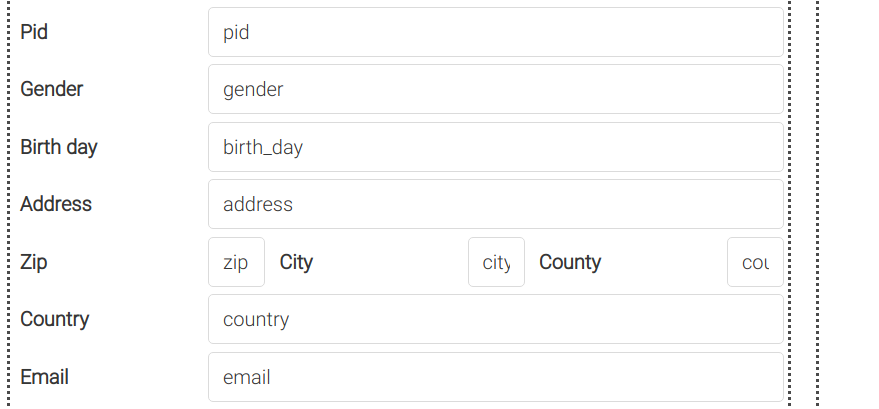

2.3 Select City and County labels, then delete them by CTRL+DEL.

2.4 Open Properties, select label Zip and change it to Zip/City/Cnty.

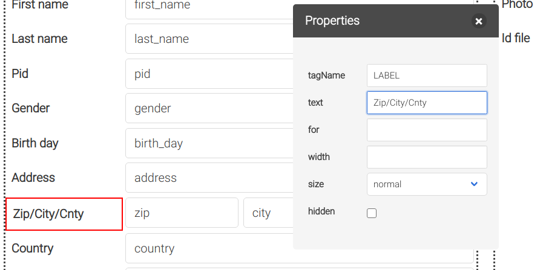

2.5 Close properties. Select left container and enlarge it by SHIFT+arrow right like this:

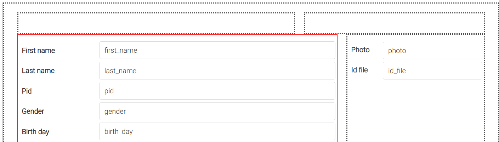

2.6 Play with the width of zip, city and county to finish like this:

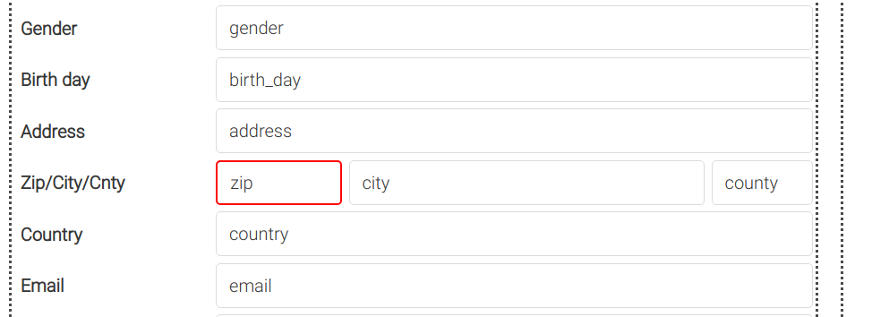

2.7 Add a title label: left click the upper left container and **Add field**. Change the label text to Patient and the size to large. Delete the input. It is better to add a field , not a simple label, because it will keep fields alignment.

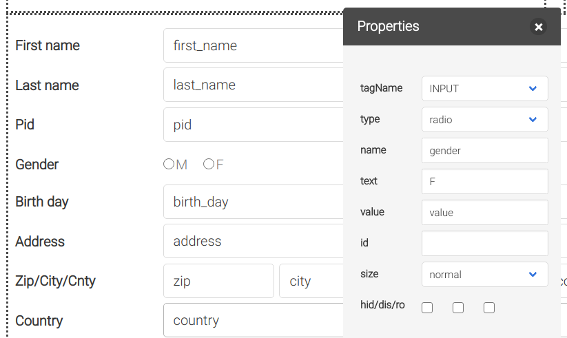

2.8 Save the form.


### 3. Field types

3.1 Open Properties popup and move it in a convenient place. 

3.2 Select gender and change it's type from text to radio. Select the first radio and change it's text from Label to M. Select the second radio and change it's text from Label to F.

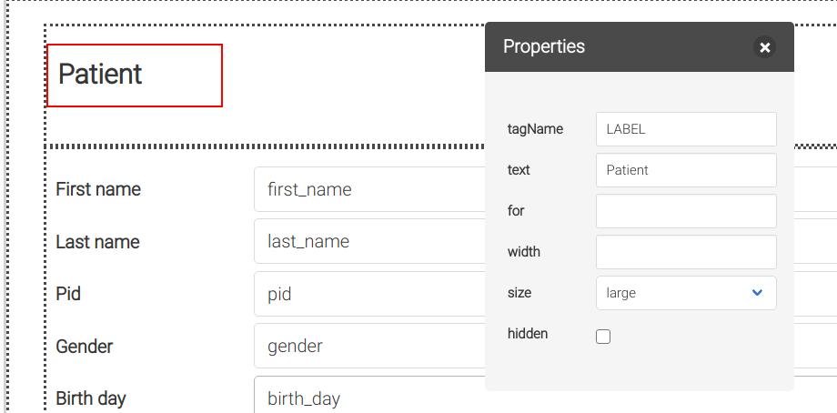

3.3 Select fields and change their type:

- birth_day => date
- email => email
- active => checkbox
- photo => image
- id_file => file

3.4 Save form.

Now you can return to the application and complete patients profile with proper data.

How to use image and file types in application:

- photo field: use right click to upload an image, then save; use left click for full size view
- id_file field: use right click to upload file, then save; use left click to view


### 4. Form CSS

4.1 Select the title label in Properties and set it's **for** property to **title**.

4.2 Open CSS editor from **css** toolbar button and write down:

```
[for=title] {
  color: green;
}
```

4.3 Click **apply** on the editor to see the change. Save form.

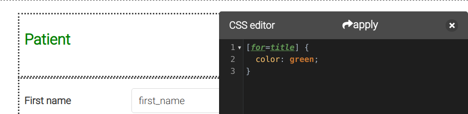


### 5. Form events

The code in the events will be executed immediately after the form load. All javascript events can be used, and Brumba specific events are added.

5.1 How to import:

```
import { $, $$, e$, br, remote, createElement, report } from '/lib/util.js'
import { notification, confirmModal } from '/lib/components.js'
import { gridRender } from '/lib/grid.js'
import { findForm } from '/lib/forms.js'
```

5.2 Form events defined and triggered by Brumba:

- **retrieve** - after data retrieve, before updating form; can block
- **update** - after form has updated/rendered it's data
- **save** - before saving data; can block
- **delete** - before deleting the current record; can block

An event handler can block normal operation by using preventDefault().

```
import { $ } from '/lib/util.js'

$('form').addEventListener('delete', e => {
  if (...) {
	e.preventDefault()
  }
})
```


### 6. Form HTML

The **html** toolbar button opens the html editor of the form. It is useful for adding elements that IDE is not covering, or simply modify on the fly, if you know what you are doing. It is a very powerful tool that opens all the html capabilities, but even a dangerous one, because IDE could not be able to recover from some mistakes. So use it carefully, and make a copy before modifying. 

It is also useful for copying forms from one application to another. To make a local copy instead, use the **Copy** context menu and a clone of the form will be created with the _COPY suffix name.