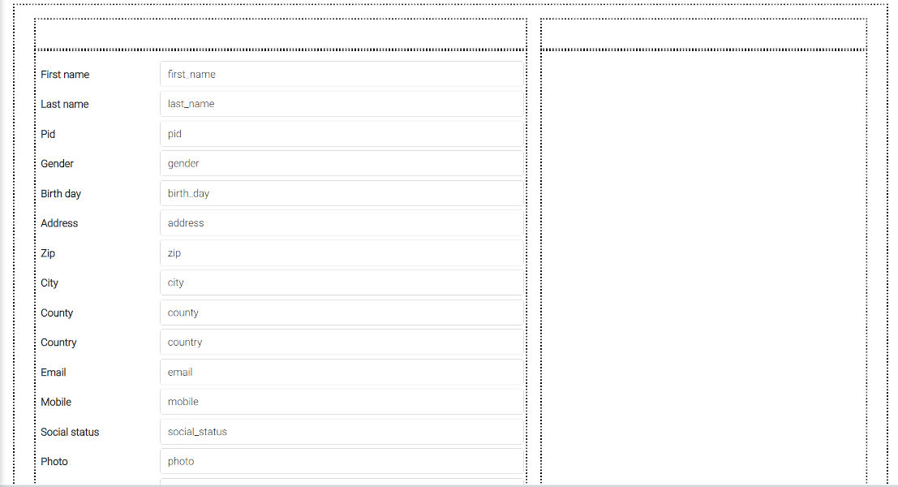
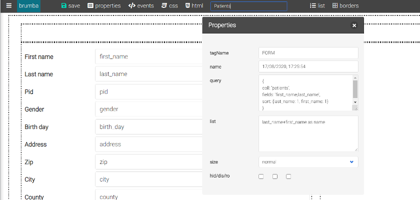
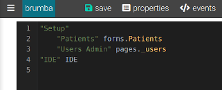

# Form

### 1. Build the first form

1.1 Enter IDE from https://localhost:3090/ide

1.2 Open TOOLS menu and write down a comma separated list of fields like: 

first_name, last_name, pid, gender, birth_day, address, zip, city, county, country, email, mobile, social_status, photo, id_file, active


then click "new Form". The new created form will look like this:



1.3 This form needs a documents list for navigation, so click on the "list" toolbar button to set it. Only a left side empty space could be observed here.

1.4 Click "properties" toolbar button to open the properties popup window. Be sure to be on the FORM tagName, and fill in query field with:

```
{
coll: 'patients',
fields: 'first_name,last_name',
sort: {last_name: 1, first_name: 1}
}
```

and list field with: 

```
last_name+first_name as name
```

1.5 Change the proposed form name (current datetime) in the toolbar name input, with the proper name Patients. Now it will look like this:



1.6 Click the "save" toolbar button, or the usual CTRL+S keyboard shortcut. The new created form will be present in the FORMS menu for further use. It is not finished, but it's already functional, and can be used to input data. Just add a menu item (MENU section):	

```
"Patients" forms.Patients
```

under Setup with a leading tab, and save. Pay attention tab indentation is important in menu definition. It will look like this:



1.7 Now you can open the application from https://localhost:3090 open Setup/Patients menu and start inserting the first patients (just the name for now). As soon as you save the firs record, it will appear in the list on the left. Insert 2-3 more names to have a navigable list, and click on list items to see the record content in the form. This is an **infinite scroll-able list**. The list can be filtered by using the two search toolbar buttons, but more on this later.


### 2. Refining the form layout